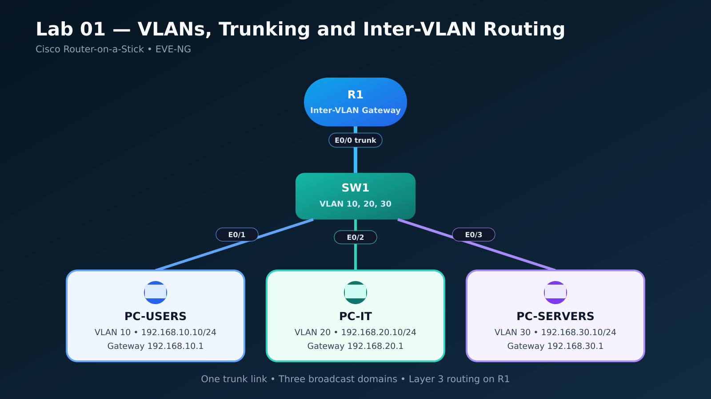
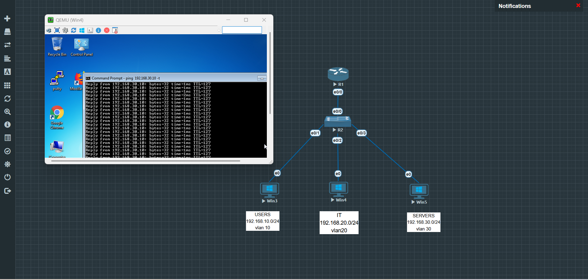

# Lab 01 — VLANs, Trunking and Inter-VLAN Routing

## Overview

This lab demonstrates how a small network can be segmented into multiple VLANs and how devices in those VLANs can communicate through **Router-on-a-Stick**.

Three Windows hosts represent the USERS, IT, and SERVERS departments. The Cisco switch provides Layer 2 segmentation, while the Cisco router performs Layer 3 routing between the VLANs over a single IEEE 802.1Q trunk.

## Skills Demonstrated

- Creating and naming VLANs
- Assigning access ports to VLANs
- Configuring an IEEE 802.1Q trunk
- Configuring Router-on-a-Stick subinterfaces
- Providing a default gateway for each VLAN
- Configuring a switch management SVI
- Verifying inter-VLAN connectivity with ICMP
- Troubleshooting VLAN, trunk, gateway, and host-firewall issues

## Topology



### Physical Connections

| Local Device | Local Interface | Remote Device | Remote Interface | Link Type |
|---|---|---|---|---|
| R1 | Ethernet0/0 | SW1 | Ethernet0/0 | 802.1Q trunk |
| SW1 | Ethernet0/1 | PC-USERS | Ethernet0 | VLAN 10 access |
| SW1 | Ethernet0/2 | PC-IT | Ethernet0 | VLAN 20 access |
| SW1 | Ethernet0/3 | PC-SERVERS | Ethernet0 | VLAN 30 access |

## VLAN and IP Addressing Plan

| Device | Interface | VLAN | IPv4 Address | Subnet Mask | Default Gateway |
|---|---|---:|---|---|---|
| R1 | Ethernet0/0.10 | 10 | 192.168.10.1 | 255.255.255.0 | — |
| R1 | Ethernet0/0.20 | 20 | 192.168.20.1 | 255.255.255.0 | — |
| R1 | Ethernet0/0.30 | 30 | 192.168.30.1 | 255.255.255.0 | — |
| SW1 | VLAN 20 SVI | 20 | 192.168.20.2 | 255.255.255.0 | 192.168.20.1 |
| PC-USERS | Ethernet0 | 10 | 192.168.10.10 | 255.255.255.0 | 192.168.10.1 |
| PC-IT | Ethernet0 | 20 | 192.168.20.10 | 255.255.255.0 | 192.168.20.1 |
| PC-SERVERS | Ethernet0 | 30 | 192.168.30.10 | 255.255.255.0 | 192.168.30.1 |

## Design and Implementation

### Layer 2 Segmentation

SW1 contains three VLANs:

| VLAN | Name | Access Port | Purpose |
|---:|---|---|---|
| 10 | USERS | Ethernet0/1 | User workstation network |
| 20 | IT | Ethernet0/2 | IT workstation and switch management |
| 30 | SERVERS | Ethernet0/3 | Server network |

Ethernet0/0 on SW1 is configured as an 802.1Q trunk and carries VLANs 10, 20, and 30 to R1.

### Inter-VLAN Routing

R1 uses three subinterfaces on Ethernet0/0. Each subinterface is associated with one VLAN using 802.1Q encapsulation and provides the default-gateway address for that subnet.

When the IT host sends traffic to the SERVERS VLAN, it forwards the packet to `192.168.20.1`. R1 routes the packet to VLAN 30 and sends it back across the trunk toward the destination host.

## Device Configurations

- [R1 configuration](configurations/R1.txt)
- [SW1 configuration](configurations/SW1.txt)

The published configurations are sanitized and do not contain passwords, password hashes, or production credentials.

## Verification

The following checks were used to validate the lab:

```text
SW1# show vlan brief
SW1# show interfaces trunk
SW1# show interfaces switchport
SW1# show ip interface brief

R1# show ip interface brief
R1# show interfaces Ethernet0/0.10
R1# show interfaces Ethernet0/0.20
R1# show interfaces Ethernet0/0.30
R1# show ip route connected
```

Inter-VLAN communication was successfully verified with ICMP. The screenshot below shows the IT host reaching the server host at `192.168.30.10`.



Additional validation and troubleshooting steps are documented in [Verification and Troubleshooting](documentation/verification-and-troubleshooting.md).

## Video Walkthrough

https://github.com/user-attachments/assets/741a7258-68ea-44b4-b1c2-eb3000c32a3b

The short demonstration shows the completed topology and successful communication between devices in different VLANs.

## How to Reproduce the Lab

1. Build the topology in EVE-NG using one Cisco router, one Cisco Layer 2 switch, and three end hosts.
2. Connect the devices according to the physical-connections table.
3. Apply the configurations from the `configurations` directory.
4. Configure the three hosts with the addresses shown in the addressing table.
5. Confirm VLAN membership and trunk operation on SW1.
6. Confirm the router subinterfaces are operational.
7. Test communication between all three VLANs.

## Repository Contents

```text
Lab-01-VLAN-Trunking-Inter-VLAN-Routing/
├── README.md
├── topology.png
├── configurations/
│   ├── R1.txt
│   └── SW1.txt
├── screenshots/
│   └── inter-vlan-ping.png
├── documentation/
│   ├── verification-and-troubleshooting.md
│   └── github-upload-notes.md
└── video/
    └── lab-01-inter-vlan-routing-demo.mp4
```

## Key Takeaways

- Each VLAN forms a separate Layer 2 broadcast domain.
- Hosts in different VLANs require a Layer 3 gateway to communicate.
- Router-on-a-Stick supports multiple VLAN gateways over one physical router interface.
- An 802.1Q trunk transports traffic for multiple VLANs between SW1 and R1.
- Correct VLAN membership, trunk allowances, IP addressing, default gateways, and host firewall settings are all required for successful connectivity.

## Author

**Tariq Sameer**  
NOC / Network Engineer — Baghdad, Iraq
