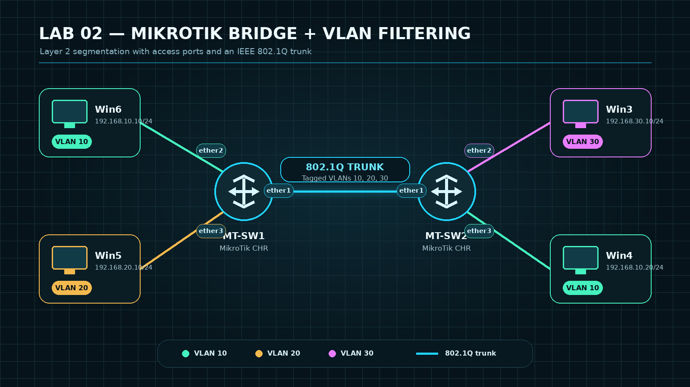

# Lab 02 – MikroTik Bridge + VLAN Filtering

## Overview

This lab demonstrates Layer 2 network segmentation using MikroTik RouterOS bridge VLAN filtering. Two MikroTik CHR switches are connected through an IEEE 802.1Q trunk that transports VLANs 10, 20, and 30 between both switches.

Access ports place untagged end-device traffic into the correct VLAN by using a Port VLAN ID (PVID). The completed lab verifies that devices in the same VLAN can communicate across the trunk while traffic between different VLANs remains isolated.

## Objectives

- Create a VLAN-aware bridge on both MikroTik switches.
- Configure access ports with the correct PVID.
- Configure an 802.1Q trunk between the switches.
- Allow VLANs 10, 20, and 30 across the trunk.
- Verify communication between devices in VLAN 10.
- Verify isolation between different VLANs.

## Topology



## Devices

| Device | Platform | Role | Management Address |
|---|---|---|---|
| MT-SW1 | MikroTik CHR 7.20.8 | Layer 2 switch | 192.168.233.201/24 |
| MT-SW2 | MikroTik CHR 7.20.8 | Layer 2 switch | 192.168.233.202/24 |
| Win6 | Windows host | VLAN 10 endpoint | N/A |
| Win5 | Windows host | VLAN 20 endpoint | N/A |
| Win3 | Windows host | VLAN 30 endpoint | N/A |
| Win4 | Windows host | VLAN 10 endpoint | N/A |

## IP Addressing and VLAN Plan

| Host | Connected Switch Port | IP Address | VLAN |
|---|---|---|---|
| Win6 | MT-SW1 ether2 | 192.168.10.10/24 | 10 |
| Win5 | MT-SW1 ether3 | 192.168.20.10/24 | 20 |
| Win3 | MT-SW2 ether2 | 192.168.30.10/24 | 30 |
| Win4 | MT-SW2 ether3 | 192.168.10.20/24 | 10 |

## Switch Port Assignment

### MT-SW1

| Interface | Port Type | PVID | Tagged VLANs | Untagged VLAN |
|---|---|---:|---|---:|
| ether1 | 802.1Q trunk to MT-SW2 | 1 | 10, 20, 30 | — |
| ether2 | Access port for Win6 | 10 | — | 10 |
| ether3 | Access port for Win5 | 20 | — | 20 |
| ether4 | Out-of-band management | — | — | Management network |

### MT-SW2

| Interface | Port Type | PVID | Tagged VLANs | Untagged VLAN |
|---|---|---:|---|---:|
| ether1 | 802.1Q trunk to MT-SW1 | 1 | 10, 20, 30 | — |
| ether2 | Access port for Win3 | 30 | — | 30 |
| ether3 | Access port for Win4 | 10 | — | 10 |
| ether4 | Out-of-band management | — | — | Management network |

## Implementation Summary

1. A bridge named `BR-LAN` was created on each MikroTik switch.
2. Interfaces `ether1`, `ether2`, and `ether3` were added as bridge ports.
3. Access ports were assigned their VLAN using the appropriate PVID.
4. Ingress filtering was enabled on the bridge ports.
5. Access ports were configured to admit only untagged and priority-tagged frames.
6. The trunk port was configured to admit only VLAN-tagged frames.
7. VLANs 10, 20, and 30 were added to the bridge VLAN table.
8. Interface `ether1` was tagged for VLANs 10, 20, and 30 on both switches.
9. The access interfaces were configured as untagged members of their assigned VLANs.
10. VLAN filtering was enabled after the bridge VLAN table was completed.

## Traffic Behavior

- Frames entering an access port are untagged.
- The access port assigns the frame to a VLAN according to its PVID.
- Frames crossing `ether1` are transmitted with an 802.1Q VLAN tag.
- The receiving switch forwards the frame only to ports belonging to the same VLAN.
- The VLAN tag is removed before the frame exits an access port.
- Communication between different VLANs is blocked because no Layer 3 routing is configured.

## Verification

### Same-VLAN Connectivity

The ping between the two VLAN 10 hosts succeeds across the trunk:

```text
Win6 192.168.10.10  →  Win4 192.168.10.20  = Success
```

This confirms that VLAN 10 is transported correctly between MT-SW1 and MT-SW2.

### VLAN Isolation

Traffic from VLAN 10 to VLAN 30 fails:

```text
Win6 192.168.10.10  →  Win3 192.168.30.10  = Destination unreachable
```

This is the expected result because the lab provides Layer 2 switching only and does not include inter-VLAN routing.

## Evidence

- `screenshots/01-MT-SW1-Bridge-Ports.png`
- `screenshots/02-MT-SW1-VLAN-Table.png`
- `screenshots/03-MT-SW2-Bridge-Ports.png`
- `screenshots/04-MT-SW2-VLAN-Table.png`
- `screenshots/05-VLAN10-Connectivity.png`
- `screenshots/06-VLAN-Isolation-Test.png`

## Configuration Files

- `configurations/MT-SW1-config.rsc`
- `configurations/MT-SW2-config.rsc`

## Video Demonstration

[Watch the Lab 02 demonstration](video/Lab-02-MikroTik-Bridge-VLAN-Filtering-Demo.mp4)

## Result

The lab successfully segmented the Layer 2 network into three VLANs. VLAN 10 connectivity worked across the trunk, while communication between separate VLANs remained isolated as intended.

