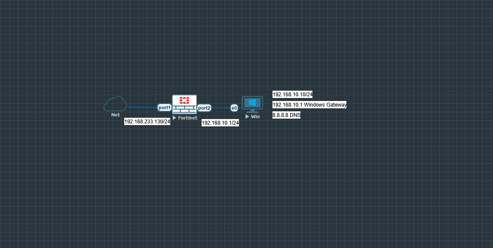

# Lab 03 – FortiGate Basic Firewall + NAT

## Overview

This lab demonstrates basic outbound Internet access through a FortiGate firewall. A Windows host on a private LAN sends traffic through FortiGate, where a firewall policy permits the traffic and Source NAT (SNAT) translates the private source address to the FortiGate WAN address.

The completed lab verifies interface configuration, the default route, policy matching, SNAT operation, Internet connectivity, and forward-traffic logging.

## Objectives

- Configure the FortiGate WAN interface as a DHCP client.
- Configure a static IPv4 address on the LAN interface.
- Verify the DHCP-learned default route.
- Create an outbound LAN-to-Internet firewall policy.
- Enable SNAT using the outgoing interface address.
- Verify Internet and DNS connectivity from the Windows client.
- Confirm the policy match and translated source address in FortiGate logs.

## Topology



## Devices

| Device | Platform | Role |
|---|---|---|
| FortiGate | FortiGate-VM 7.2.0 | Firewall, default gateway, and SNAT device |
| Win | Windows host | Internal LAN client |
| Net | EVE-NG external/NAT network | Upstream Internet connectivity |

## IP Addressing

| Device | Interface | Address | Purpose |
|---|---|---|---|
| FortiGate | port1 | DHCP (`192.168.233.130/24` during validation) | WAN/upstream connection |
| FortiGate | port2 | `192.168.10.1/24` | LAN gateway |
| Windows | e0 | `192.168.10.10/24` | LAN client |
| Windows | Default gateway | `192.168.10.1` | FortiGate port2 |
| Windows | DNS server | `8.8.8.8` | DNS resolution |
| Upstream | Gateway | `192.168.233.2` | Learned through DHCP on port1 |

> The WAN address is assigned by DHCP and may be different when the lab is started in another environment.

## Interface Roles

| Interface | Role | Configuration |
|---|---|---|
| port1 | WAN | DHCP client; receives the WAN address and default gateway |
| port2 | LAN | Static address `192.168.10.1/24` |

Administrative access on `port1` is enabled only for management inside the isolated EVE-NG lab environment.

## Firewall Policy

| Setting | Value |
|---|---|
| Name | `LAN-to-Internet` |
| Incoming interface | `port2` |
| Outgoing interface | `port1` |
| Source | `all` |
| Destination | `all` |
| Schedule | `always` |
| Service | `ALL` |
| Action | `ACCEPT` |
| NAT | Enabled |
| NAT method | Use outgoing interface address |
| Logging | All sessions |

## Implementation Summary

1. `port1` was configured as a DHCP client for WAN connectivity.
2. `port2` was assigned `192.168.10.1/24` and used as the Windows default gateway.
3. The Windows client was configured with `192.168.10.10/24`, gateway `192.168.10.1`, and DNS server `8.8.8.8`.
4. FortiGate learned a default route through `192.168.233.2` on `port1`.
5. The `LAN-to-Internet` firewall policy was created from `port2` to `port1`.
6. SNAT was enabled using the current `port1` address.
7. Logging was enabled for all accepted sessions.

## Traffic Flow

1. The Windows client sends traffic to its gateway, `192.168.10.1`.
2. FortiGate receives the packet on `port2`.
3. The `LAN-to-Internet` policy permits the session.
4. SNAT changes the source from `192.168.10.10` to the `port1` address.
5. FortiGate forwards the packet through `port1` using the default route.
6. Return traffic is matched to the existing session and translated back to the Windows client.

## Verification

### Client Connectivity

The Windows client successfully reached the LAN gateway, a public IP address, and Internet websites:

```text
ping 192.168.10.1  = Success
ping 8.8.8.8       = Success
DNS resolution     = Success
Web browsing       = Success
```

### Routing Table

The FortiGate routing table contained a candidate default route and both directly connected networks:

```text
S* 0.0.0.0/0 via 192.168.233.2, port1
C  192.168.10.0/24 is directly connected, port2
C  192.168.233.0/24 is directly connected, port1
```

### Policy and SNAT Validation

The policy counter increased after the Windows client generated Internet traffic. Forward Traffic logs showed the source host `192.168.10.10` matching policy `LAN-to-Internet`.

Detailed session information confirmed the source translation:

```text
Original source: 192.168.10.10
Translated IP:   192.168.233.130
Source interface: port2
Destination interface: port1
```

## Evidence

- `screenshots/01-FortiGate-Interfaces.png`
- `screenshots/02-LAN-to-Internet-Policy.png`
- `screenshots/03-Internet-Connectivity.png`
- `screenshots/04-Forward-Traffic-Logs.png`
- `screenshots/05-NAT-Translation-Details.png`
- `screenshots/06-Routing-Table.png`

## Configuration File

- `configurations/FortiGate-Lab-03-config.conf`

The configuration file contains only the lab-relevant interface, firewall policy, SNAT, and local logging settings. Device-specific UUID values and unrelated system configuration were excluded.

## Video Demonstration

[Watch the Lab 03 demonstration](video/Lab-03-FortiGate-Basic-Firewall-NAT-Demo.mp4)

## Result

The lab successfully provided outbound Internet access to the private LAN. FortiGate permitted traffic through the `LAN-to-Internet` policy, translated the source address with SNAT, forwarded traffic through the DHCP-learned default route, and recorded the accepted sessions in Forward Traffic logs.
