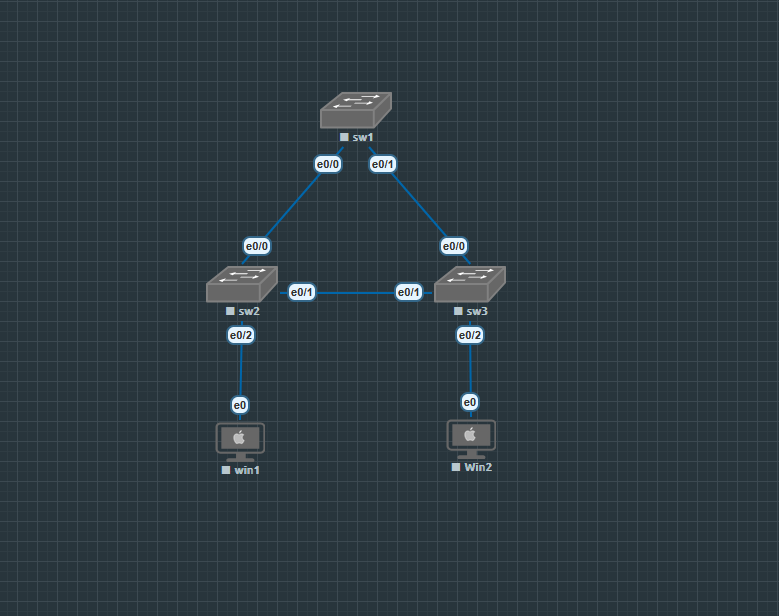
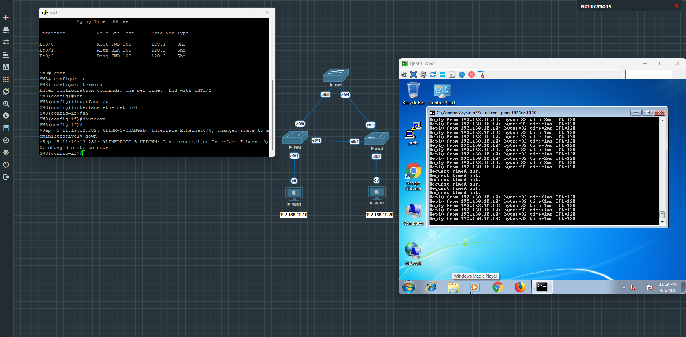
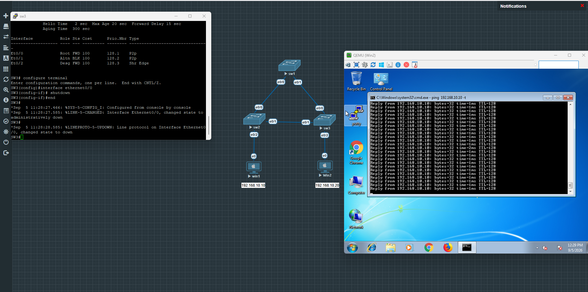
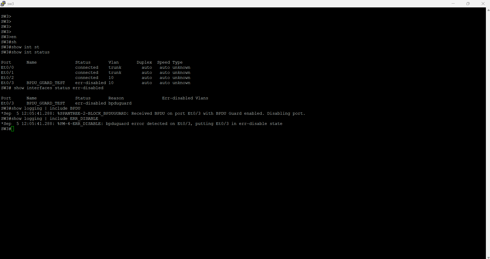

# Lab 04 – Cisco PVST and Rapid-PVST

## Overview

This lab demonstrates Layer 2 loop prevention and redundancy using Cisco PVST and Rapid-PVST in EVE-NG. Three switches form a redundant triangle, while two Windows hosts in VLAN 10 generate continuous traffic during controlled link failures.

The lab compares convergence behavior, verifies root-bridge and port-role selection, and demonstrates how PortFast and BPDU Guard protect edge ports.

## Objectives

- Build a redundant Layer 2 topology using three Cisco switches.
- Configure VLAN 10 across access and trunk links.
- Elect SW1 as the primary root bridge and SW2 as the secondary root bridge.
- Identify root, designated, and alternate STP port roles.
- Compare observed PVST and Rapid-PVST convergence during the same link failure.
- Configure PortFast and BPDU Guard on edge ports.
- Trigger, verify, and recover from a BPDU Guard `err-disabled` event.

## Topology



| Device | Interface | Connected to | Purpose |
| --- | --- | --- | --- |
| SW1 | Ethernet0/0 | SW2 Ethernet0/0 | VLAN 10 trunk |
| SW1 | Ethernet0/1 | SW3 Ethernet0/0 | VLAN 10 trunk |
| SW2 | Ethernet0/1 | SW3 Ethernet0/1 | VLAN 10 trunk / redundant path |
| SW2 | Ethernet0/2 | Win1 Ethernet0 | VLAN 10 access port |
| SW3 | Ethernet0/2 | Win2 Ethernet0 | VLAN 10 access port |

## Addressing

| Host | IPv4 address | Subnet mask | Default gateway |
| --- | --- | --- | --- |
| Win1 | 192.168.10.10 | 255.255.255.0 | Not required |
| Win2 | 192.168.10.20 | 255.255.255.0 | Not required |

Both hosts are in the same Layer 2 VLAN, so no router or default gateway is required for host-to-host connectivity.

## STP Design

| Switch | STP function | Configured priority for VLAN 10 | Displayed bridge priority |
| --- | --- | --- | --- |
| SW1 | Primary root | 24576 | 24586 |
| SW2 | Secondary root | 28672 | 28682 |
| SW3 | Default priority | 32768 | 32778 |

The displayed priority includes the VLAN 10 extended system ID. For example, SW1 is displayed as `24576 + 10 = 24586`.

SW1 is intentionally selected as the root because it has direct links to both access switches. SW2 is configured as the secondary root so the backup root is predictable if SW1 fails.

## Phase 1 – PVST

PVST was configured first:

```cisco
spanning-tree mode pvst
```

Root roles were assigned with:

```cisco
! SW1
spanning-tree vlan 10 root primary

! SW2
spanning-tree vlan 10 root secondary
```

Before failure, SW3 selected Ethernet0/0 as its root port and placed Ethernet0/1 in the alternate blocking state:

```text
Et0/0  Root  FWD  100
Et0/1  Altn  BLK  100
Et0/2  Desg  FWD  100
```

A continuous ping was started from Win2 to Win1. Shutting down SW3 Ethernet0/0 forced STP to use the path through SW2. The observed PVST reconvergence caused six `Request timed out` messages.



After convergence, SW3 used Ethernet0/1 as the root port with a total root-path cost of 200:

```text
SW3 -> SW2 = 100
SW2 -> SW1 = 100
Total cost  = 200
```

## Phase 2 – Rapid-PVST

All switches were migrated to Rapid-PVST:

```cisco
spanning-tree mode rapid-pvst
```

Inter-switch interfaces were explicitly configured as point-to-point links. Host-facing ports were configured as edge ports with PortFast and protected with BPDU Guard.

```cisco
interface range ethernet0/0 - 1
 spanning-tree link-type point-to-point

interface ethernet0/2
 spanning-tree portfast
 spanning-tree bpduguard enable
```

SW3 verification showed RSTP operation, point-to-point inter-switch links, and an edge host port:

```text
Spanning tree enabled protocol rstp

Et0/0  Root  FWD  100  P2p
Et0/1  Altn  BLK  100  P2p
Et0/2  Desg  FWD  100  Shr Edge
```

The same SW3 Ethernet0/0 failure was repeated. Ethernet0/1 rapidly became the root forwarding port, and the continuous ping showed no observed packet loss.



## PVST vs Rapid-PVST Result

| Test | PVST | Rapid-PVST |
| --- | --- | --- |
| Failed link | SW3 Ethernet0/0 | SW3 Ethernet0/0 |
| Backup path | SW3 → SW2 → SW1 | SW3 → SW2 → SW1 |
| Backup root-path cost | 200 | 200 |
| Observed ping loss | 6 timeouts | 0 timeouts |
| Convergence behavior | Timer-based transition | Rapid proposal/agreement |

The packet-loss figures are the observed results from this EVE-NG test, not guaranteed convergence values for every platform or topology.

## PortFast and BPDU Guard Test

PortFast allows a host-facing port to enter forwarding immediately. It does not remove the port from STP. BPDU Guard adds protection by disabling a PortFast edge port if a BPDU is received.

For a controlled test, SW3 Ethernet0/3 was temporarily configured as an edge port with BPDU Guard and connected to SW1 Ethernet0/2. SW1 sent a BPDU, so SW3 correctly placed Ethernet0/3 into `err-disabled` state.

```text
Et0/3  BPDU_GUARD_TEST  err-disabled  bpduguard

%SPANTREE-2-BLOCK_BPDUGUARD: Received BPDU on port Et0/3 with BPDU Guard enabled. Disabling port.
%PM-4-ERR_DISABLE: bpduguard error detected on Et0/3, putting Et0/3 in err-disable state
```



The temporary link was removed before recovery. The test interfaces were returned to default configuration, and SW3 Ethernet0/3 was recovered with a controlled `shutdown` / `no shutdown` cycle.

## Verification Commands

```cisco
show spanning-tree vlan 10
show interfaces trunk
show interfaces status
show interfaces status err-disabled
show logging | include BPDU
show logging | include ERR_DISABLE
```

Full observed command output is stored in the [`verification`](verification/) directory. Reproducible device configurations are stored in [`configurations`](configurations/).

## Evidence

| File | Evidence |
| --- | --- |
| [01-Topology.png](screenshots/01-Topology.png) | Physical and logical lab layout |
| [02-Baseline-Connectivity.png](screenshots/02-Baseline-Connectivity.png) | Successful VLAN 10 host connectivity |
| [03-PVST-Failover-6-Timeouts.png](screenshots/03-PVST-Failover-6-Timeouts.png) | PVST reconvergence and packet loss |
| [04-Rapid-PVST-Failover-No-Packet-Loss.png](screenshots/04-Rapid-PVST-Failover-No-Packet-Loss.png) | RSTP roles and rapid failover |
| [05-BPDU-Guard-Test-Topology.png](screenshots/05-BPDU-Guard-Test-Topology.png) | Temporary controlled BPDU Guard test link |
| [06-BPDU-Guard-ErrDisabled.png](screenshots/06-BPDU-Guard-ErrDisabled.png) | Err-disabled reason and system log evidence |

## Key Findings

- Root bridge placement determines the preferred Layer 2 forwarding topology.
- A secondary root bridge makes failover behavior predictable.
- STP blocks one redundant path to prevent a Layer 2 loop while keeping that path available for recovery.
- Rapid-PVST converged with no observed ping loss in this test, compared with six timeouts under PVST.
- PortFast accelerates host connectivity but should be used only on edge ports.
- BPDU Guard protected the topology by disabling an edge port that unexpectedly received a BPDU.
- An `err-disabled` port must be diagnosed and its cause removed before recovery.

## Platform

- EVE-NG
- Cisco IOS Layer 2 switches
- Windows test hosts
- VLAN 10
- PVST and Rapid-PVST

