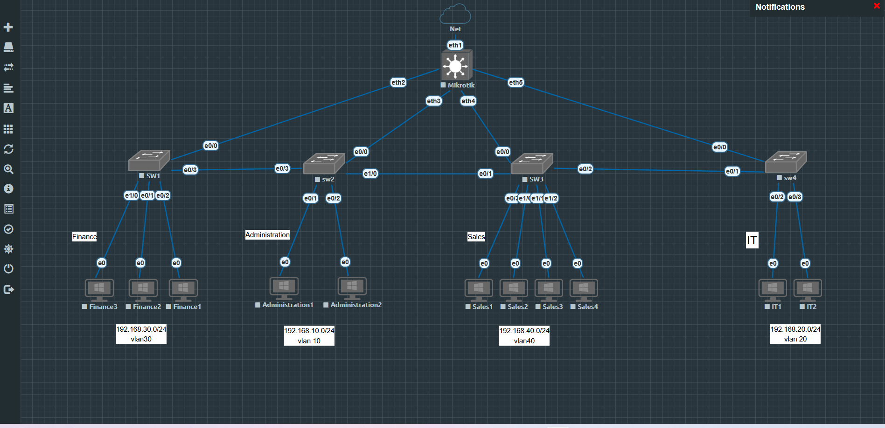

# Lab 05 — Enterprise VLAN Segmentation, MikroTik Services & MSTP Redundancy

A multi-department enterprise-style EVE-NG lab combining Cisco Layer 2 switching, MikroTik routing/services, VLAN segmentation, management access, firewall policy, and MSTP redundancy.



## Objectives

- Segment departments using VLANs.
- Carry VLANs over 802.1Q trunks.
- Use MikroTik as the inter-VLAN gateway and Internet edge.
- Provide DHCP and DNS forwarding for client VLANs.
- Provide Internet access using source NAT / masquerade.
- Restrict inter-department access while allowing the IT department to manage the network.
- Build a dedicated management VLAN.
- Use MSTP to prevent Layer 2 loops and provide a backup path.
- Validate failover while maintaining client Internet connectivity.

## Topology

The lab contains:

- 1 MikroTik CHR router
- 4 Cisco switches
- Multiple Windows endpoints
- EVE-NG network/cloud uplink

The MikroTik router connects to every access switch, while the Cisco switches also have inter-switch trunks. MSTP prevents loops and selects the active Layer 2 path.

## VLAN and IP Plan

| VLAN | Department | Subnet | Gateway |
|---|---|---|---|
| 10 | Administration | 192.168.10.0/24 | 192.168.10.1 |
| 20 | IT | 192.168.20.0/24 | 192.168.20.1 |
| 30 | Finance | 192.168.30.0/24 | 192.168.30.1 |
| 40 | Sales | 192.168.40.0/24 | 192.168.40.1 |
| 99 | Management | 192.168.99.0/24 | 192.168.99.1 |

### Management addresses

| Device | Management IP |
|---|---|
| SW1-FINANCE | 192.168.99.11 |
| SW2-ADMIN | 192.168.99.12 |
| SW3-SALES | 192.168.99.13 |
| SW4-IT | 192.168.99.14 |

## MSTP Design

All Cisco switches use the same MST region:

- Region name: `COMPANY`
- Revision: `1`
- MST instance 1: VLANs `10,20,30,40,99`

Root design:

- SW2-ADMIN: primary root, priority 24576
- SW3-SALES: secondary root, priority 28672

SW4 uses two possible upstream paths. The direct `SW4 -> MikroTik` path has a deliberately higher MST cost, making it the standby path during normal operation.

Normal state on SW4:

```text
Et0/0  Altn BLK  10000000
Et0/1  Root FWD   2000000
```

During the redundancy test, `Et0/1` was administratively shut down. MSTP reconverged and promoted `Et0/0`:

```text
Et0/0  Root FWD  10000000
```

Client Internet connectivity continued with approximately one second of interruption.

## MikroTik Services

The MikroTik CHR provides:

- Inter-VLAN routing
- Default gateways for VLANs 10/20/30/40/99
- DHCP for user VLANs
- DNS forwarding
- WAN DHCP client
- Source NAT / masquerade
- Stateful firewall filtering

DHCP pools use approximately `.100-.200` in each department subnet.

## Security Policy

The IT department is trusted for network administration.

| Source | Internal Access | Internet |
|---|---:|---:|
| IT VLAN 20 | Allowed | Allowed |
| Administration VLAN 10 | Blocked | Allowed |
| Finance VLAN 30 | Blocked | Allowed |
| Sales VLAN 40 | Blocked | Allowed |

The first firewall rule accepts established and related connections so return traffic for legitimate sessions is preserved.

## Management Access

IT clients can access all switch management addresses through VLAN 99.

Example validation:

- IT client -> `192.168.99.14` successful
- PuTTY login to SW4 successful
- Management traffic is routed through the MikroTik gateway

The Cisco switches have a management SVI on VLAN 99 and a static default route toward `192.168.99.1`.

## Validation Results

The lab was validated with:

- DHCP lease acquisition
- Inter-VLAN routing
- DNS resolution
- Internet ping
- Firewall isolation tests
- IT-to-management access
- PuTTY remote management
- Traceroute
- MSTP normal-state verification
- MSTP failover verification

See [`documentation/validation-results.md`](documentation/validation-results.md) and the `screenshots/` directory.

## Important Troubleshooting Observation

After restoring a previously failed trunk, MSTP returned to the expected roles, but traffic initially stopped. Clearing the dynamic MAC address table restored forwarding.

This was a useful reminder that successful STP/MSTP convergence does not always mean the forwarding database has immediately relearned the correct path in a virtual lab environment.

## Repository Structure

```text
Lab-05-Enterprise-VLAN-MSTP-MikroTik/
├── README.md
├── topology.png
├── configurations/
│   ├── SW1-FINANCE.cfg
│   ├── SW2-ADMIN.cfg
│   ├── SW3-SALES.cfg
│   ├── SW4-IT.cfg
│   └── MikroTik-Router.rsc
├── screenshots/
│   ├── 01-topology.png
│   ├── 02-firewall-policy.png
│   ├── 03-vlan-isolation-and-internet.png
│   ├── 04-it-remote-management.png
│   ├── 05-mst-normal-state.png
│   ├── 06-mst-failover-continuous-ping.png
│   └── 07-traceroute-validation.png
└── documentation/
    └── validation-results.md
```

## Notes

The configuration files in this repository are cleaned versions matching the final validated lab state. They are intended for documentation and portfolio use.

The EVE-NG `.unl` file is not included in this package and can be added later if exported from the lab.

## Technologies

Cisco IOS · MikroTik RouterOS · VLAN · 802.1Q · MSTP · DHCP · DNS · NAT · Firewall · Inter-VLAN Routing · EVE-NG
