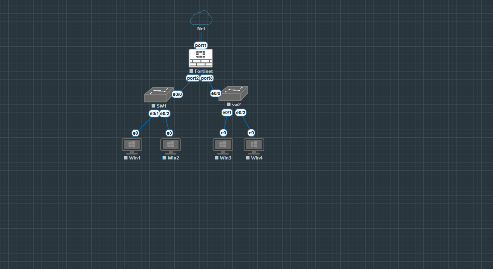
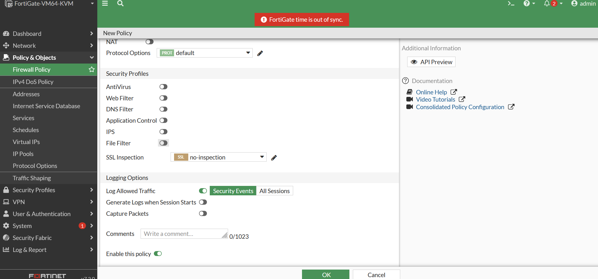

# Lab 06 — FortiGate DHCP + Multiple LANs

A hands-on FortiGate lab built in EVE-NG to practice creating multiple LAN interfaces, providing DHCP to each LAN, and controlling inter-LAN traffic with a firewall policy.

## Objectives

- Configure two independent LANs on FortiGate.
- Configure DHCP Server on both LAN interfaces.
- Verify that clients receive IP address, gateway, and DNS settings automatically.
- Verify Layer 2 connectivity inside each LAN.
- Create a firewall policy from STAFF to OFFICE.
- Practice FortiGate troubleshooting using routing, ARP, packet sniffer, debug flow, and session/policy inspection.

## Topology

```text
                       EVE-NG Cloud / Management
                                |
                              port1
                                |
                          +-------------+
                          |  FortiGate  |
                          +-------------+
                           /           \
                    port2 /             \ port3
                         /               \
                  +-----+-----+       +-----+-----+
                  |    SW1    |       |    SW2    |
                  |  OFFICE   |       |   STAFF   |
                  +-----+-----+       +-----+-----+
                    |       |           |       |
                  Win1    Win2        Win3    Win4
```



## Addressing Plan

| Segment | FortiGate Interface | Gateway | DHCP Range |
|---|---|---|---|
| Management | port1 | 192.168.233.130/24 | External/EVE management |
| OFFICE | port2 | 192.168.10.1/24 | 192.168.10.10 - 192.168.10.100 |
| STAFF | port3 | 192.168.20.1/24 | 192.168.20.10 - 192.168.20.100 |

Observed client leases during testing included:

- Win1: `192.168.10.10/24`
- Win2: `192.168.10.11/24`
- Win3: `192.168.20.10/24`
- Win4: `192.168.20.11/24`

## Firewall Policy

The lab policy was configured as:

| Setting | Value |
|---|---|
| Name | STAFF-to-OFFICE |
| Incoming Interface | port3 / STAFF-LAN |
| Outgoing Interface | port2 / OFFICE-LAN |
| Source | all |
| Destination | all |
| Schedule | always |
| Service | ALL |
| Action | ACCEPT |
| NAT | Disabled |
| Logging | All Sessions |



## Verification

The following were successfully verified during the lab:

- DHCP operation on both LANs.
- FortiGate ARP entries for OFFICE and STAFF clients.
- FortiGate could ping `192.168.10.11` and `192.168.20.11` after ICMP was allowed on the Windows hosts.
- Hosts connected to the same switch/LAN could ping each other.
- FortiGate routing table contained both directly connected networks.
- The STAFF-to-OFFICE policy was present and compiled as an ACCEPT policy from interface index 5 (port3) to interface index 4 (port2).

## Troubleshooting Note

Inter-LAN ICMP forwarding from STAFF (`192.168.20.0/24`) to OFFICE (`192.168.10.0/24`) remained unresolved in this EVE-NG run. Debug flow showed the packet arriving on port3 and a valid route being selected through port2, but processing stopped after the route lookup and the packet was not observed leaving port2.

This unresolved behavior is intentionally documented rather than hidden: the lab was useful for practicing a structured troubleshooting workflow involving Windows Firewall, FortiGate policies, routing, ARP, interface state, packet sniffing, debug flow, and compiled policy inspection.

See [docs/TROUBLESHOOTING.md](docs/TROUBLESHOOTING.md) for the investigation notes.

## Repository Structure

```text
Lab-06-FortiGate-DHCP-Multiple-LANs/
├── README.md
├── configs/
│   ├── fortigate.conf
│   └── switches.txt
├── docs/
│   └── TROUBLESHOOTING.md
└── screenshots/
    ├── 01-topology.png
    ├── 02-firewall-policy-configuration.png
    ├── 03-firewall-policy-list.png
    ├── 04-interface-overview.png
    ├── 05-interface-status.png
    ├── 06-office-client-dhcp.png
    ├── 07-staff-client-dhcp.png
    ├── 08-client-connectivity-test.png
    ├── 09-windows-icmp-firewall-rule.png
    └── 10-fortigate-dashboard.png
```

## Platform

- EVE-NG
- FortiGate-VM64-KVM
- FortiOS 7.2.0 build 1157
- Cisco Layer 2 switches
- Windows test clients

---

**Network Engineering Portfolio — Lab 06**
